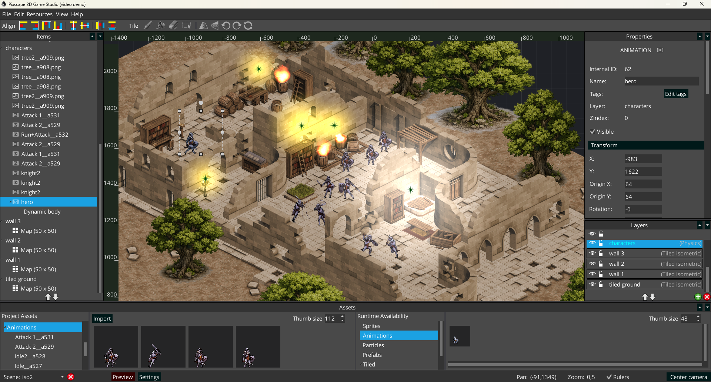

# Pixscape Tiled Iso Demo



This repository contains a small test project using **Pixscape Runtime**.

It demonstrates an isometric Tiled map with Pixscape’s **2.5D rendering features**.

The project can run on:

- Desktop
- Android
- HTML

The project was generated with **LibGDX LiftOff**.

## Open in Pixscape Studio

To open the project in **Pixscape Studio**, load the following file:

```text
studio-projet/tiled-iso-demo.json
```

## Links

- Pixscape website: https://pixscape.games/
- Pixscape Studio releases: https://github.com/pixscapegames/pixscape-studio-releases
- Pixscape Runtime: https://github.com/pixscapegames/pixscape-runtime
