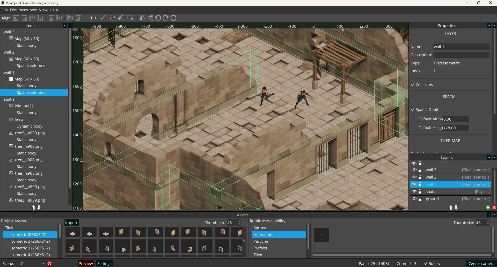

# Pixscape Tiled Iso Demo

This repository contains a small test project using **Pixscape Runtime**.

It demonstrates an isometric Tiled map with Pixscape’s **2.5D rendering features**, physics, animations, particles, prefabs, and simple combat gameplay.

## Controls

### Desktop / HTML

* **Arrow keys** — Move the hero
* **Space** — Attack

### Android

* **Swipe** — Move the hero
* **Double tap** — Attack

The project can run on:

* Desktop
* Android
* HTML

The project was generated with **LibGDX LiftOff**.

The Pixscape Studio project is located in the **studio** directory.

If you wish to modify the scene or add new scenes, use **Pixscape Studio Free**.

## Links

* Pixscape website: https://pixscape.games/
* Pixscape Studio releases: https://github.com/pixscapegames/pixscape-studio-releases
* Pixscape Runtime: https://github.com/pixscapegames/pixscape-runtime
